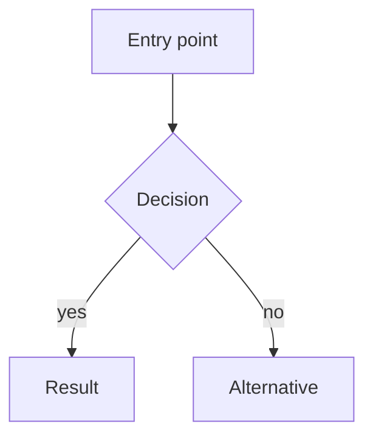

# Visual Artifact — {Feature name}

> Experimental lane — `docs/workflows/experimental-feature-workflow.md`.
> Copy to `docs/experiments/{slug}/visual-artifact.md`.
> Pick **exactly one** form below and delete the rest. Text-only planning does not satisfy
> the Standard Lane. This is the one human checkpoint before code — it exists to be looked at.

## Form A — Mermaid flow

Best for a multi-step process or a decision the user walks through.



## Form B — Low-fidelity wireframes (2–4)

Best for layout and information hierarchy. ASCII is fine and preferred over a design tool.

```text
┌─────────────────────────────┐
│ Header                      │
├─────────────────────────────┤
│ [ ] item                    │
│ [ ] item                    │
├─────────────────────────────┤
│ (+) add                     │
└─────────────────────────────┘
```

## Form C — State storyboard

Best for a single surface with several states. One short block per state.

| State   | What the user sees | How they got here |
| ------- | ------------------ | ----------------- |
| Empty   |                    |                   |
| Loading |                    |                   |
| Loaded  |                    |                   |
| Error   |                    |                   |

## Form D — Storybook state set

Best when the experiment reuses existing components. Name the stories you will write and
the state each pins, then link the built Storybook once it runs.

- `{Component}/Default` — …
- `{Component}/{EdgeCase}` — …

---

## Notes

{Anything the picture can't carry — motion, timing, a constraint. Keep it short.}
